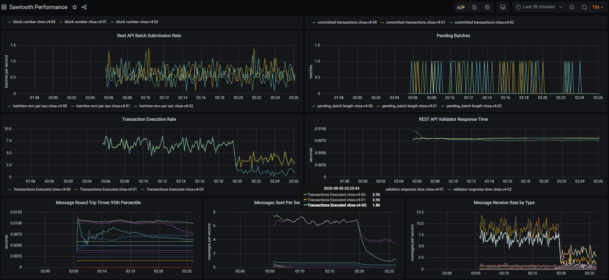

# Permission a transaction processor

Build and run the `Ubuntu 16.04 (Xenial)` containers.

```bash
docker-compose up --build -d
```

The stack includes the following hosts:

host | services
---- | --------
`chsa-c4-00` | `validator`, `identity-tp`, `settings-tp`, `intkey-tp-python`, `xo-tp-python` and `rest-api`
`chsa-c4-01` | `validator`, `identity-tp`, `settings-tp`, `intkey-tp-python`, `xo-tp-python` and `rest-api`
`chsa-c4-02` | `validator`, `identity-tp`, `settings-tp`, `intkey-tp-python`, `xo-tp-python` and `rest-api`
`chsa-c4-influxdb` | InfluxDB time series database
`chsa-c4-grafana` | Grafana monitoring visualization <http://localhost:53000> (u:admin/p:admin)
`chsa-c4-loadgen` | Intkey load generator

Create a policy to only allow `chsa-c4-00`, and `chsa-c4-01` to form the network in the future.

<details><summary>show</summary>
<p>

## Retreive the `chsa-c4-01` Validator public key

1. Open a terminal session in the Intkey load generator.

```bash
docker exec -u sysops -it chsa-c4-01 bash
```

2. Copy the public key.

```bash
sudo cat /etc/sawtooth/keys/validator.pub
```

```text
0255d19743e68b902fdc4b9877296447f5125aed7f93bb8c106eec87aec02a5d73
```

## Retreive the `chsa-c4-00` Validator public key and create the policy

1. Open a terminal session in the `chsa-c4-00`.

```bash
docker exec -u sysops -it chsa-c4-00 bash
```

2. Configure the identity transaction siger public key.

```bash
sawset proposal create \
sawtooth.identity.allowed_keys=$(cat ~/.sawtooth/keys/sysops.pub)
```

3. Configure the policy.

```bash
sawtooth identity policy create validators \
"PERMIT_KEY $(cat /etc/sawtooth/keys/validator.pub)" \
"PERMIT_KEY 0255d19743e68b902fdc4b9877296447f5125aed7f93bb8c106eec87aec02a5d73" \
"DENY_KEY *"
```

```text
Policy committed in 0.127158 sec
```

4. Create the role that includes the policy.

```bash
sawtooth identity role create network validators
```

```text
Role committed in 0.143538 sec
```

## Validate

1. Check the transaction statitics from the Grafana dashboard.



### References

* sawtooth.hyperledger.org > Docs > Release 1.0.5  > System Administrator's Guide > Configuring Permissions > [Off-Chain Transactor Permissioning](https://sawtooth.hyperledger.org/docs/core/releases/1.0.5/sysadmin_guide/configuring_permissions.html#off-chain-transactor-permissioning)
* **Missing in 1.0.5 documentation**: [Install identity TP](https://stackoverflow.com/questions/49302852/how-to-use-sawtooth-identity-tp-processor)

</p>
</details>

Once finished, run the following command to stop and cleanup the docker lab environment.

```bash
docker-compose down --remove-orphans -v
```
